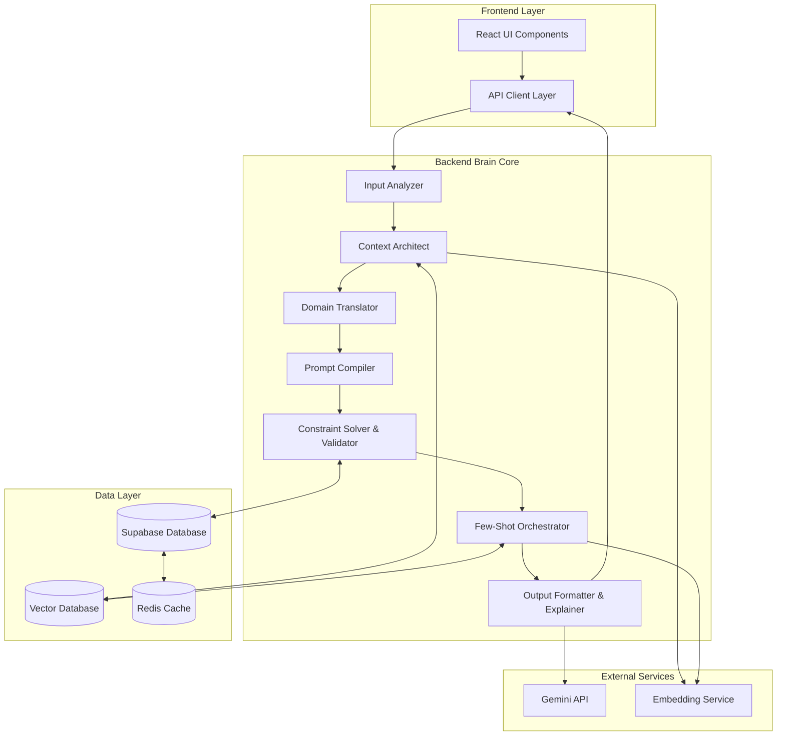

# Backend Brain Design Document

## Overview

The Backend Brain is a sophisticated prompt enhancement engine designed as a modular, high-performance system that transforms raw user inputs into domain-rich, contextually enhanced prompts. The system follows a pipeline architecture with seven core modules that work in sequence to analyze, enrich, and validate prompts while maintaining enterprise-grade performance and accuracy.

The architecture leverages the existing React/TypeScript frontend with Supabase backend, integrating seamlessly with the current tech stack while introducing new specialized services for prompt processing and AI integration.

## Architecture

### High-Level Architecture



### System Flow

1. **Input Processing**: Raw user prompt enters through React UI
2. **Analysis Pipeline**: Seven-stage enhancement process
3. **Data Retrieval**: Context and examples from vector database
4. **Validation**: Quality assurance and constraint enforcement
5. **Output Generation**: Enhanced prompt with metadata and provenance
6. **Optional Execution**: Gemini API integration for final output

## Components and Interfaces

### 1. Input Analyzer

**Purpose**: Normalizes and analyzes raw user input to extract key information and determine processing strategy.

**Interface**:
```typescript
interface InputAnalyzer {
  analyze(rawInput: string): Promise<AnalysisResult>
}

interface AnalysisResult {
  tokens: string[]
  entities: Entity[]
  keywords: string[]
  constraints: Constraint[]
  contextScore: number
  suggestedDomains: Domain[]
  confidence: number
}

interface Entity {
  text: string
  type: 'PERSON' | 'ORG' | 'LOCATION' | 'CONCEPT' | 'ACTION'
  confidence: number
}
```

**Implementation Strategy**:
- Use natural language processing for entity extraction
- Implement keyword density analysis
- Apply constraint detection patterns
- Calculate context richness score
- Domain classification using pre-trained models

### 2. Context Architect

**Purpose**: Retrieves and organizes domain-specific knowledge, frameworks, and historical examples.

**Interface**:
```typescript
interface ContextArchitect {
  buildContext(analysis: AnalysisResult): Promise<ContextPackage>
}

interface ContextPackage {
  domainKnowledge: DomainKnowledge[]
  techniques: Technique[]
  frameworks: Framework[]
  vocabulary: DomainVocabulary
  examples: HistoricalExample[]
}

interface DomainKnowledge {
  domain: Domain
  principles: string[]
  bestPractices: string[]
  commonPatterns: string[]
  expertVocabulary: string[]
}
```

**Implementation Strategy**:
- Vector similarity search for relevant domain knowledge
- Template matching for framework selection
- Semantic search for historical examples
- Domain-specific vocabulary injection

### 3. Domain Translator

**Purpose**: Converts generic prompts into domain-aware, expert-level instructions with appropriate tone and style.

**Interface**:
```typescript
interface DomainTranslator {
  translate(input: string, context: ContextPackage): Promise<TranslationResult>
}

interface TranslationResult {
  domainEnrichedPrompt: string
  roleInstructions: string
  toneAdjustments: ToneAdjustment[]
  styleGuide: StyleGuide
  expertVocabulary: string[]
}

interface ToneAdjustment {
  original: string
  enhanced: string
  reasoning: string
}
```

**Implementation Strategy**:
- Template-based prompt transformation
- Role-specific instruction generation
- Tone and style mapping based on domain
- Expert vocabulary substitution

### 4. Prompt Compiler

**Purpose**: Combines all elements into a cohesive, structured prompt with proper formatting and organization.

**Interface**:
```typescript
interface PromptCompiler {
  compile(translation: TranslationResult, context: ContextPackage, fewShots: FewShotExample[]): Promise<CompiledPrompt>
}

interface CompiledPrompt {
  systemPrompt: string
  userPrompt: string
  fewShotExamples: FewShotExample[]
  constraints: PromptConstraint[]
  metadata: CompilationMetadata
}

interface CompilationMetadata {
  totalTokens: number
  complexityScore: number
  domainConfidence: number
  enhancementRatio: number
}
```

**Implementation Strategy**:
- Structured prompt assembly
- Token optimization
- Constraint integration
- Metadata generation

### 5. Constraint Solver & Validator

**Purpose**: Ensures output meets quality standards, safety requirements, and format specifications.

**Interface**:
```typescript
interface ConstraintValidator {
  validate(prompt: CompiledPrompt): Promise<ValidationResult>
  enforce(prompt: CompiledPrompt, constraints: Constraint[]): Promise<CompiledPrompt>
}

interface ValidationResult {
  isValid: boolean
  violations: Violation[]
  qualityScore: number
  safetyScore: number
  suggestions: string[]
}

interface Violation {
  type: 'LENGTH' | 'FORMAT' | 'SAFETY' | 'QUALITY'
  severity: 'LOW' | 'MEDIUM' | 'HIGH'
  message: string
  suggestion: string
}
```

**Implementation Strategy**:
- Rule-based validation engine
- Content safety filtering
- Quality scoring algorithms
- Automatic correction mechanisms

### 6. Few-Shot Orchestrator

**Purpose**: Dynamically selects and optimizes few-shot examples based on semantic similarity and success metrics.

**Interface**:
```typescript
interface FewShotOrchestrator {
  selectExamples(context: ContextPackage, maxExamples: number): Promise<FewShotExample[]>
  rankExamples(examples: FewShotExample[], query: string): Promise<RankedExample[]>
}

interface FewShotExample {
  id: string
  input: string
  output: string
  domain: Domain
  successScore: number
  usageCount: number
  lastUsed: Date
  embedding: number[]
}

interface RankedExample extends FewShotExample {
  relevanceScore: number
  reasoning: string
}
```

**Implementation Strategy**:
- Vector similarity matching
- Multi-armed bandit optimization
- Success score weighting
- Recency bias adjustment

### 7. Output Formatter & Explainer

**Purpose**: Formats the final enhanced prompt and generates comprehensive metadata including provenance and reasoning.

**Interface**:
```typescript
interface OutputFormatter {
  format(prompt: CompiledPrompt, metadata: EnhancementMetadata): Promise<FormattedOutput>
}

interface FormattedOutput {
  enhancedText: string
  enhancedJson: StructuredPrompt
  whySummary: string
  provenance: ProvenanceData
  qualityScore: number
  metadata: OutputMetadata
}

interface ProvenanceData {
  originalInput: string
  enhancementSteps: EnhancementStep[]
  sourceTechniques: string[]
  domainSources: string[]
  confidenceScores: Record<string, number>
}
```

**Implementation Strategy**:
- Multi-format output generation
- Provenance tracking throughout pipeline
- Quality assessment and scoring
- Human-readable explanation generation

## Data Models

### Core Entities

```sql
-- Users table (extends existing)
CREATE TABLE users (
  id UUID PRIMARY KEY DEFAULT gen_random_uuid(),
  email TEXT UNIQUE NOT NULL,
  credit_balance INTEGER DEFAULT 100,
  preferences JSONB DEFAULT '{}',
  created_at TIMESTAMP WITH TIME ZONE DEFAULT NOW(),
  updated_at TIMESTAMP WITH TIME ZONE DEFAULT NOW()
);

-- Prompts table for audit and history
CREATE TABLE prompts (
  id UUID PRIMARY KEY DEFAULT gen_random_uuid(),
  user_id UUID REFERENCES users(id) ON DELETE CASCADE,
  raw_text TEXT NOT NULL,
  timestamp TIMESTAMP WITH TIME ZONE DEFAULT NOW(),
  session_id TEXT,
  ip_address INET
);

-- Enhanced prompts with full metadata
CREATE TABLE enhanced_prompts (
  id UUID PRIMARY KEY DEFAULT gen_random_uuid(),
  prompt_id UUID REFERENCES prompts(id) ON DELETE CASCADE,
  enhanced_text TEXT NOT NULL,
  enhanced_json JSONB NOT NULL,
  domain TEXT NOT NULL,
  techniques TEXT[] DEFAULT '{}',
  provenance JSONB NOT NULL,
  quality_score DECIMAL(3,2) NOT NULL,
  enhancement_ratio DECIMAL(5,2) NOT NULL,
  processing_time_ms INTEGER NOT NULL,
  created_at TIMESTAMP WITH TIME ZONE DEFAULT NOW()
);

-- Domain knowledge templates
CREATE TABLE templates (
  id UUID PRIMARY KEY DEFAULT gen_random_uuid(),
  domain TEXT NOT NULL,
  technique TEXT NOT NULL,
  framework TEXT,
  content JSONB NOT NULL,
  few_shots JSONB DEFAULT '[]',
  success_score DECIMAL(3,2) DEFAULT 0.5,
  usage_count INTEGER DEFAULT 0,
  last_used TIMESTAMP WITH TIME ZONE,
  created_at TIMESTAMP WITH TIME ZONE DEFAULT NOW(),
  updated_at TIMESTAMP WITH TIME ZONE DEFAULT NOW()
);

-- User feedback for learning
CREATE TABLE feedback (
  id UUID PRIMARY KEY DEFAULT gen_random_uuid(),
  enhanced_prompt_id UUID REFERENCES enhanced_prompts(id) ON DELETE CASCADE,
  user_id UUID REFERENCES users(id) ON DELETE CASCADE,
  action TEXT NOT NULL CHECK (action IN ('copy', 'save', 'regenerate', 'rate')),
  rating INTEGER CHECK (rating BETWEEN 1 AND 5),
  timestamp TIMESTAMP WITH TIME ZONE DEFAULT NOW(),
  metadata JSONB DEFAULT '{}'
);

-- Credit transactions
CREATE TABLE credit_transactions (
  id UUID PRIMARY KEY DEFAULT gen_random_uuid(),
  user_id UUID REFERENCES users(id) ON DELETE CASCADE,
  amount INTEGER NOT NULL,
  transaction_type TEXT NOT NULL CHECK (transaction_type IN ('debit', 'credit', 'refund')),
  reference_id UUID, -- references enhanced_prompts(id) for debits
  description TEXT,
  timestamp TIMESTAMP WITH TIME ZONE DEFAULT NOW(),
  metadata JSONB DEFAULT '{}'
);

-- Vector embeddings for semantic search
CREATE TABLE embeddings (
  id UUID PRIMARY KEY DEFAULT gen_random_uuid(),
  content_id UUID NOT NULL,
  content_type TEXT NOT NULL CHECK (content_type IN ('template', 'example', 'domain_knowledge')),
  embedding vector(1536), -- OpenAI embedding dimension
  metadata JSONB DEFAULT '{}',
  created_at TIMESTAMP WITH TIME ZONE DEFAULT NOW()
);

-- Indexes for performance
CREATE INDEX idx_enhanced_prompts_domain ON enhanced_prompts(domain);
CREATE INDEX idx_enhanced_prompts_quality ON enhanced_prompts(quality_score DESC);
CREATE INDEX idx_templates_domain ON templates(domain);
CREATE INDEX idx_templates_success ON templates(success_score DESC);
CREATE INDEX idx_feedback_action ON feedback(action);
CREATE INDEX idx_embeddings_content ON embeddings(content_type, content_id);
```

### Vector Database Schema

Using pgvector extension in Supabase for semantic search:

```sql
-- Enable vector extension
CREATE EXTENSION IF NOT EXISTS vector;

-- Function for similarity search
CREATE OR REPLACE FUNCTION match_templates(
  query_embedding vector(1536),
  match_threshold float,
  match_count int,
  domain_filter text DEFAULT NULL
)
RETURNS TABLE (
  id uuid,
  content jsonb,
  similarity float
)
LANGUAGE plpgsql
AS $$
BEGIN
  RETURN QUERY
  SELECT
    t.id,
    t.content,
    1 - (e.embedding <=> query_embedding) AS similarity
  FROM templates t
  JOIN embeddings e ON e.content_id = t.id AND e.content_type = 'template'
  WHERE 1 - (e.embedding <=> query_embedding) > match_threshold
    AND (domain_filter IS NULL OR t.domain = domain_filter)
  ORDER BY e.embedding <=> query_embedding
  LIMIT match_count;
END;
$$;
```

## Error Handling

### Error Categories

1. **Input Validation Errors**
   - Empty or invalid input
   - Unsupported content types
   - Rate limiting violations

2. **Processing Errors**
   - Domain detection failures
   - Context retrieval timeouts
   - Validation failures

3. **External Service Errors**
   - Gemini API failures
   - Embedding service timeouts
   - Database connection issues

4. **Business Logic Errors**
   - Insufficient credits
   - Content safety violations
   - Quality threshold failures

### Error Handling Strategy

```typescript
interface BackendBrainError {
  code: string
  message: string
  category: 'INPUT' | 'PROCESSING' | 'EXTERNAL' | 'BUSINESS'
  severity: 'LOW' | 'MEDIUM' | 'HIGH' | 'CRITICAL'
  retryable: boolean
  metadata?: Record<string, any>
}

class ErrorHandler {
  static handle(error: BackendBrainError): ErrorResponse {
    // Log error with appropriate level
    // Determine retry strategy
    // Generate user-friendly message
    // Track error metrics
  }
}
```

### Retry Logic

- **Exponential backoff** for external API calls
- **Circuit breaker pattern** for service dependencies
- **Graceful degradation** when non-critical services fail
- **Fallback mechanisms** for each processing stage

## Testing Strategy

### Unit Testing

- **Module isolation**: Each Backend Brain module tested independently
- **Mock dependencies**: External services and database calls mocked
- **Edge case coverage**: Invalid inputs, boundary conditions, error scenarios
- **Performance testing**: Latency and throughput benchmarks

### Integration Testing

- **Pipeline testing**: End-to-end prompt enhancement flow
- **Database integration**: Real database operations with test data
- **API integration**: Actual Gemini API calls with test prompts
- **Cross-module communication**: Interface contracts and data flow

### Performance Testing

- **Load testing**: Concurrent user scenarios
- **Stress testing**: System limits and breaking points
- **Latency testing**: Sub-1.5s response time validation
- **Memory profiling**: Resource usage optimization

### Quality Assurance

- **Enhancement quality metrics**: Before/after prompt comparison
- **Domain accuracy testing**: Expert validation of domain-specific enhancements
- **Safety testing**: Content filtering and harmful content detection
- **User acceptance testing**: Real user feedback on enhancement quality

### Test Data Management

```typescript
interface TestScenario {
  name: string
  input: string
  expectedDomain: Domain
  expectedEnhancementRatio: number
  qualityThreshold: number
  maxProcessingTime: number
}

const testScenarios: TestScenario[] = [
  {
    name: "Marketing Copy Enhancement",
    input: "Write an email about our new product",
    expectedDomain: "marketing",
    expectedEnhancementRatio: 50.0,
    qualityThreshold: 0.8,
    maxProcessingTime: 1500
  },
  // Additional test scenarios...
];
```

### Continuous Testing

- **Automated test suite** runs on every commit
- **Performance regression testing** with baseline comparisons
- **Quality monitoring** in production with real user data
- **A/B testing** for enhancement algorithm improvements