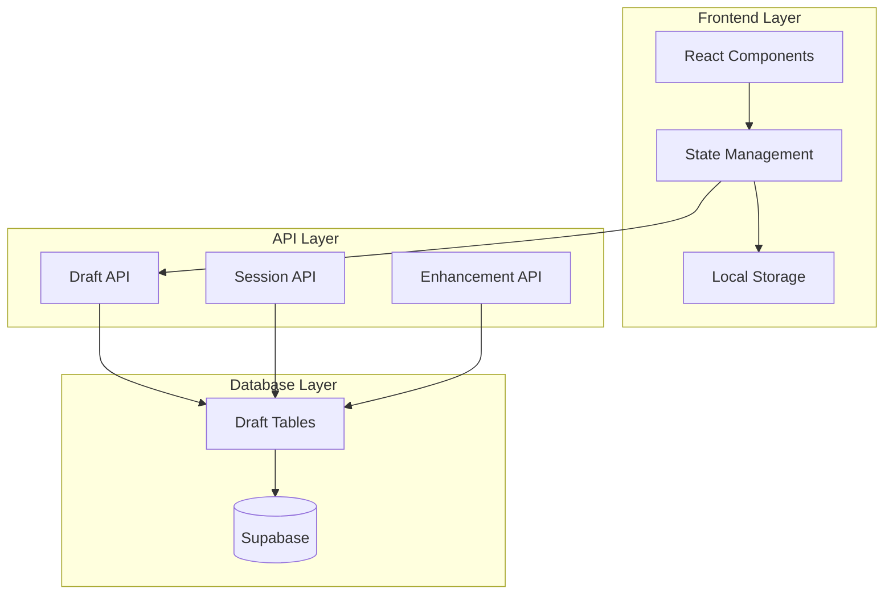

# Design Document

## Overview

The PromptBrain Dashboard revamp focuses on creating a polished, reliable user experience with seamless input persistence, improved chat interface, and modern UI components. The design maintains the existing three-column layout (sidebar, main content, credits orb) while enhancing each component with better UX patterns, consistent styling, and robust data persistence.

## Architecture

### High-Level Architecture



### Component Architecture

The dashboard follows a hierarchical component structure:

```
Dashboard2ProRedesigned
├── AppShell (Layout Container)
│   ├── CollapsibleSidebar (Navigation)
│   ├── Main Content Area
│   │   ├── AppShellHero (Title Section)
│   │   ├── PromptConsole (Input Interface)
│   │   └── ChatThread (Output Display)
│   └── FloatingCreditsOrb (Credits Display)
```

## Components and Interfaces

### 1. Input Persistence System

#### Frontend State Management
- **React State**: Immediate UI updates and user interaction
- **localStorage**: Browser-level persistence for offline reliability
- **Debounced Sync**: 500ms debounce to prevent excessive API calls

#### Backend Persistence
- **Draft API**: RESTful endpoints for draft management
- **Database Schema**: New `draft_prompts` table for server-side storage

```typescript
interface DraftPrompt {
  id: string
  user_id: string
  content: string
  mode: 'ideate' | 'flow'
  last_updated: string
  metadata?: {
    cursor_position?: number
    flow_state?: FlowState
  }
}
```

### 2. Enhanced Chat Interface

#### Chat Thread Component
Replaces the current history display with an inline conversation thread:

```typescript
interface ChatMessage {
  id: string
  type: 'user' | 'assistant'
  content: string
  timestamp: string
  mode: 'ideate' | 'flow'
  metadata?: {
    quality_score?: number
    enhancement_ratio?: number
  }
}

interface ChatThreadProps {
  messages: ChatMessage[]
  isLoading: boolean
  onMessageAction: (messageId: string, action: string) => void
}
```

#### Message Flow
1. User submits prompt → Creates user message
2. Enhancement processing → Shows loading state
3. Backend response → Creates assistant message
4. Both messages appear in chronological order

### 3. Redesigned Sidebar

#### Interaction Model
- **Default State**: Collapsed (icons only, 72px width)
- **Expanded State**: Full width (260px) with labels and descriptions
- **Trigger**: Click to toggle (no hover behavior)
- **Animation**: Smooth Framer Motion transitions (<150ms)

#### Navigation Structure
```typescript
interface SidebarItem {
  id: string
  icon: LucideIcon
  label: string
  description: string
  badge?: number
  active?: boolean
}

const navigationItems = [
  { id: 'enhance', icon: Zap, label: 'Enhance', description: 'Prompt enhancement' },
  { id: 'history', icon: History, label: 'History', description: 'Recent enhancements' },
  { id: 'archive', icon: Archive, label: 'Archive', description: 'Saved prompts' },
  // ... more items
]
```

### 4. Visual Design System

#### Color Palette (Apple/Chronicle-inspired)
```css
:root {
  /* Neutrals */
  --color-background: #0a0a0a;
  --color-surface: #1a1a1a;
  --color-surface-elevated: #2a2a2a;
  
  /* Text */
  --color-text-primary: #ffffff;
  --color-text-secondary: #a1a1aa;
  --color-text-muted: #71717a;
  
  /* Accents */
  --color-accent-gold: #ffd700;
  --color-accent-blue: #3b82f6;
  --color-accent-purple: #8b5cf6;
  
  /* Semantic */
  --color-success: #10b981;
  --color-warning: #f59e0b;
  --color-error: #ef4444;
}
```

#### Typography Scale
```css
:root {
  --font-display: 'Inter', system-ui, sans-serif;
  --font-body: 'Inter', system-ui, sans-serif;
  
  --text-xs: 0.75rem;    /* 12px */
  --text-sm: 0.875rem;   /* 14px */
  --text-base: 1rem;     /* 16px */
  --text-lg: 1.125rem;   /* 18px */
  --text-xl: 1.25rem;    /* 20px */
  --text-2xl: 1.5rem;    /* 24px */
  --text-3xl: 1.875rem;  /* 30px */
}
```

#### Spacing & Layout
```css
:root {
  --space-1: 0.25rem;   /* 4px */
  --space-2: 0.5rem;    /* 8px */
  --space-3: 0.75rem;   /* 12px */
  --space-4: 1rem;      /* 16px */
  --space-6: 1.5rem;    /* 24px */
  --space-8: 2rem;      /* 32px */
  
  --radius-sm: 0.375rem;  /* 6px */
  --radius-md: 0.5rem;    /* 8px */
  --radius-lg: 0.75rem;   /* 12px */
  --radius-xl: 1rem;      /* 16px */
}
```

## Data Models

### 1. Draft Persistence Schema

```sql
CREATE TABLE draft_prompts (
  id UUID PRIMARY KEY DEFAULT gen_random_uuid(),
  user_id UUID REFERENCES auth.users(id) ON DELETE CASCADE,
  content TEXT NOT NULL DEFAULT '',
  mode TEXT NOT NULL DEFAULT 'ideate' CHECK (mode IN ('ideate', 'flow')),
  metadata JSONB DEFAULT '{}',
  created_at TIMESTAMP WITH TIME ZONE DEFAULT NOW(),
  updated_at TIMESTAMP WITH TIME ZONE DEFAULT NOW()
);

-- Indexes for performance
CREATE INDEX idx_draft_prompts_user_id ON draft_prompts(user_id);
CREATE INDEX idx_draft_prompts_updated_at ON draft_prompts(updated_at DESC);

-- RLS policies
ALTER TABLE draft_prompts ENABLE ROW LEVEL SECURITY;
CREATE POLICY "Users can manage their own drafts" ON draft_prompts
  FOR ALL USING (auth.uid() = user_id);
```

### 2. Session State Schema

```sql
CREATE TABLE user_sessions (
  id UUID PRIMARY KEY DEFAULT gen_random_uuid(),
  user_id UUID REFERENCES auth.users(id) ON DELETE CASCADE,
  last_mode TEXT NOT NULL DEFAULT 'ideate' CHECK (last_mode IN ('ideate', 'flow')),
  sidebar_collapsed BOOLEAN DEFAULT true,
  preferences JSONB DEFAULT '{}',
  last_active TIMESTAMP WITH TIME ZONE DEFAULT NOW(),
  
  UNIQUE(user_id)
);
```

### 3. Enhanced Chat History

Extend existing `enhanced_prompts` table to support chat threading:

```sql
ALTER TABLE enhanced_prompts ADD COLUMN IF NOT EXISTS thread_id UUID;
ALTER TABLE enhanced_prompts ADD COLUMN IF NOT EXISTS message_type TEXT DEFAULT 'enhancement' CHECK (message_type IN ('user_input', 'enhancement', 'system'));
ALTER TABLE enhanced_prompts ADD COLUMN IF NOT EXISTS parent_message_id UUID REFERENCES enhanced_prompts(id);

CREATE INDEX idx_enhanced_prompts_thread_id ON enhanced_prompts(thread_id);
CREATE INDEX idx_enhanced_prompts_parent_id ON enhanced_prompts(parent_message_id);
```

## Error Handling

### 1. Draft Persistence Errors

#### Network Failures
- **Fallback**: localStorage maintains local copy
- **Retry Logic**: Exponential backoff (1s, 2s, 4s, 8s)
- **User Feedback**: Subtle indicator showing sync status

#### Conflict Resolution
- **Strategy**: Last-write-wins with timestamp comparison
- **User Choice**: Option to keep local or server version when conflicts detected

### 2. Enhancement Failures

#### API Errors
- **Credit Rollback**: Automatic refund on enhancement failure
- **User Notification**: Clear error message with retry option
- **Graceful Degradation**: Maintain input state for retry

#### Rate Limiting
- **Queue System**: Queue requests when rate limited
- **User Feedback**: Show position in queue and estimated wait time

### 3. UI Error States

#### Loading States
- **Skeleton Components**: Smooth loading placeholders
- **Progressive Enhancement**: Show partial content while loading
- **Timeout Handling**: Fallback after 30 seconds

## Testing Strategy

### 1. Unit Testing

#### Component Tests
- **Input Persistence**: Test localStorage and API sync
- **Sidebar Behavior**: Test collapse/expand animations
- **Chat Interface**: Test message rendering and interactions

#### Service Tests
- **Draft API**: Test CRUD operations and error handling
- **Session Management**: Test state persistence and restoration

### 2. Integration Testing

#### User Flows
- **Draft Persistence**: Test cross-tab and cross-session persistence
- **Enhancement Flow**: Test end-to-end prompt enhancement
- **Navigation**: Test sidebar and mode switching

#### Performance Tests
- **Animation Performance**: Ensure <150ms sidebar animations
- **API Response Times**: Test draft sync performance
- **Memory Usage**: Test for memory leaks in long sessions

### 3. Accessibility Testing

#### Keyboard Navigation
- **Tab Order**: Logical tab sequence through interface
- **Keyboard Shortcuts**: Test ⌘B sidebar toggle, ⌘Enter enhancement
- **Focus Management**: Proper focus handling during navigation

#### Screen Reader Support
- **ARIA Labels**: Comprehensive labeling for all interactive elements
- **Live Regions**: Proper announcements for dynamic content
- **Semantic HTML**: Use appropriate HTML elements and roles

### 4. Cross-Browser Testing

#### Browser Compatibility
- **Modern Browsers**: Chrome, Firefox, Safari, Edge (latest 2 versions)
- **Mobile Browsers**: iOS Safari, Chrome Mobile
- **Feature Detection**: Graceful degradation for unsupported features

## Performance Considerations

### 1. Frontend Optimization

#### Bundle Splitting
- **Route-based**: Separate bundles for different dashboard sections
- **Component-based**: Lazy load heavy components (charts, advanced features)
- **Library Splitting**: Separate vendor bundles for better caching

#### State Management
- **Selective Updates**: Use React.memo and useMemo for expensive computations
- **Debounced Actions**: Prevent excessive API calls and re-renders
- **Virtual Scrolling**: For large chat histories and lists

### 2. API Optimization

#### Caching Strategy
- **Browser Cache**: Cache static assets with long TTL
- **API Cache**: Cache user preferences and session data
- **CDN**: Serve static assets from CDN

#### Request Optimization
- **Batch Operations**: Combine multiple draft updates
- **Compression**: Enable gzip/brotli compression
- **Connection Pooling**: Optimize database connections

### 3. Database Performance

#### Query Optimization
- **Proper Indexing**: Index frequently queried columns
- **Query Planning**: Analyze and optimize slow queries
- **Connection Limits**: Manage database connection pool

#### Data Archival
- **Old Drafts**: Archive drafts older than 30 days
- **History Cleanup**: Implement retention policies for chat history
- **Soft Deletes**: Use soft deletes for user data recovery

## Security Considerations

### 1. Data Protection

#### Input Sanitization
- **XSS Prevention**: Sanitize all user inputs
- **SQL Injection**: Use parameterized queries
- **Content Validation**: Validate prompt content and metadata

#### Authentication & Authorization
- **Row Level Security**: Enforce user data isolation
- **API Authentication**: Validate user tokens on all requests
- **Session Management**: Secure session handling and timeout

### 2. Privacy

#### Data Minimization
- **Draft Retention**: Automatic cleanup of old drafts
- **Metadata Limits**: Store only necessary metadata
- **User Consent**: Clear privacy policy for data usage

#### Encryption
- **Data at Rest**: Encrypt sensitive data in database
- **Data in Transit**: Use HTTPS for all communications
- **Client Storage**: Encrypt sensitive data in localStorage

## Deployment Strategy

### 1. Database Migration

#### Schema Changes
- **Incremental Migrations**: Add new tables without breaking existing functionality
- **Backward Compatibility**: Ensure old clients continue working during rollout
- **Rollback Plan**: Prepare rollback scripts for each migration

### 2. Feature Rollout

#### Phased Deployment
- **Phase 1**: Input persistence and basic UI improvements
- **Phase 2**: Enhanced chat interface and sidebar redesign
- **Phase 3**: Advanced features and performance optimizations

#### Feature Flags
- **Gradual Rollout**: Enable features for percentage of users
- **A/B Testing**: Compare old vs new interface performance
- **Quick Rollback**: Ability to disable features instantly

### 3. Monitoring

#### Performance Metrics
- **Core Web Vitals**: Monitor LCP, FID, CLS
- **API Performance**: Track response times and error rates
- **User Engagement**: Monitor feature usage and satisfaction

#### Error Tracking
- **Client Errors**: Track JavaScript errors and crashes
- **API Errors**: Monitor server errors and failures
- **User Feedback**: Collect and analyze user reports