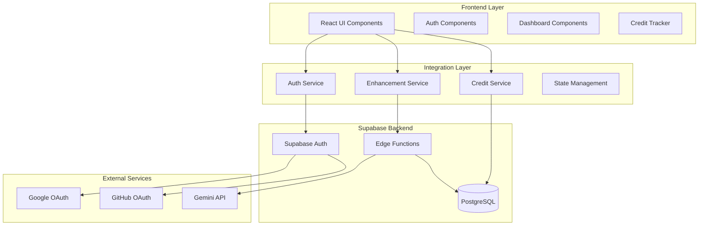

# Design Document

## Overview

This design document outlines the technical architecture for integrating the existing PromptBrain frontend UI components with the Supabase backend infrastructure. The integration creates a seamless user experience that connects authentication flows, credit management, and prompt enhancement workflows into a cohesive AI-powered platform.

## Architecture

### System Components



### Data Flow Architecture

The system follows a unidirectional data flow pattern with clear separation of concerns:

1. **UI Layer**: React components handle user interactions and display
2. **Service Layer**: Business logic and API communication
3. **Backend Layer**: Data persistence and processing
4. **State Management**: Real-time synchronization between UI and backend

## Components and Interfaces

### Authentication Service

**Purpose**: Manages user authentication across multiple providers and handles new user initialization.

**Interface**:
```typescript
interface AuthService {
  signUp(email: string, password: string, fullName: string): Promise<AuthResult>
  signIn(email: string, password: string): Promise<AuthResult>
  signInWithGoogle(): Promise<AuthResult>
  signInWithGitHub(): Promise<AuthResult>
  signOut(): Promise<AuthResult>
  getCurrentUser(): Promise<User | null>
  onAuthStateChange(callback: AuthStateCallback): Unsubscribe
}

interface AuthResult {
  success: boolean
  user?: User
  error?: string
  session?: Session
}
```

**Key Features**:
- Multi-provider authentication (Email/Password, Google OAuth, GitHub OAuth)
- Automatic user profile creation with initial credit allocation
- Session management and state persistence
- Real-time authentication state updates

### Credit Management Service

**Purpose**: Handles credit operations with 24-hour lazy refresh mechanism and real-time balance tracking.

**Interface**:
```typescript
interface CreditService {
  getUserCredits(userId: string): Promise<CreditBalance>
  checkAndRefreshCredits(userId: string): Promise<CreditRefreshResult>
  deductCredits(userId: string, amount: number, reason: string): Promise<CreditTransaction>
  subscribeToCredits(userId: string, callback: CreditUpdateCallback): Unsubscribe
}

interface CreditBalance {
  balance: number
  lastRefresh: Date
  nextRefresh: Date
}

interface CreditRefreshResult {
  wasRefreshed: boolean
  newBalance: number
  previousBalance: number
}
```

**Key Features**:
- Lazy refresh mechanism (checks 24-hour window only during user actions)
- Atomic credit transactions with rollback capability
- Real-time balance updates across UI components
- Audit trail for all credit operations

### Enhancement Workflow Service

**Purpose**: Orchestrates the prompt enhancement process with credit validation and error handling.

**Interface**:
```typescript
interface EnhancementService {
  enhancePrompt(request: EnhanceRequest): Promise<EnhanceResponse>
  validateCredits(userId: string): Promise<CreditValidation>
  processEnhancement(prompt: string, userId: string, options?: EnhanceOptions): Promise<EnhancementResult>
}

interface EnhanceRequest {
  prompt: string
  userId: string
  mode: 'ideate' | 'flow'
  options?: EnhanceOptions
}

interface EnhancementResult {
  success: boolean
  enhancedText?: string
  enhancedJson?: any
  whySummary?: string
  qualityScore?: number
  metadata?: EnhancementMetadata
  error?: EnhancementError
}
```

**Key Features**:
- Pre-flight credit validation
- Integration with existing Backend Brain Edge Function
- Comprehensive error handling and user feedback
- Performance monitoring and quality metrics

## Data Models

### User Profile Schema

```sql
CREATE TABLE profiles (
  id UUID PRIMARY KEY REFERENCES auth.users(id) ON DELETE CASCADE,
  email TEXT NOT NULL,
  full_name TEXT,
  avatar_url TEXT,
  credits INTEGER NOT NULL DEFAULT 20,
  last_credit_refresh TIMESTAMP WITH TIME ZONE DEFAULT NOW(),
  created_at TIMESTAMP WITH TIME ZONE DEFAULT NOW(),
  updated_at TIMESTAMP WITH TIME ZONE DEFAULT NOW()
);
```

### Credit System Schema

The existing credit system schema includes:
- `user_credits` table for balance tracking
- `credits_log` table for audit trail
- RPC functions for atomic operations (`spend_credits`, `add_credits`, `get_user_balance`)

### Enhancement History Schema

```sql
CREATE TABLE enhanced_prompts (
  id UUID PRIMARY KEY DEFAULT gen_random_uuid(),
  user_id UUID NOT NULL REFERENCES auth.users(id) ON DELETE CASCADE,
  raw_text TEXT NOT NULL,
  enhanced_text TEXT NOT NULL,
  enhanced_json JSONB,
  domain TEXT,
  techniques TEXT[],
  quality_score DECIMAL(3,2),
  enhancement_ratio DECIMAL(5,2),
  processing_time_ms INTEGER,
  created_at TIMESTAMP WITH TIME ZONE DEFAULT NOW()
);
```

## Error Handling

### Error Classification

1. **Authentication Errors**
   - Invalid credentials
   - OAuth provider failures
   - Session expiration
   - Network connectivity issues

2. **Credit System Errors**
   - Insufficient credits
   - Transaction failures
   - Database connectivity issues
   - Concurrent modification conflicts

3. **Enhancement Errors**
   - Invalid input validation
   - Edge function timeouts
   - Gemini API failures
   - Processing errors

### Error Recovery Strategies

**Authentication Failures**:
- Automatic retry with exponential backoff
- Clear error messaging with suggested actions
- Graceful fallback to alternative auth methods

**Credit System Failures**:
- Transaction rollback on partial failures
- Optimistic UI updates with rollback capability
- Real-time balance synchronization

**Enhancement Failures**:
- No credit deduction on processing failures
- Detailed error reporting with context
- Retry mechanisms for transient failures

### User Feedback Patterns

```typescript
interface ErrorFeedback {
  type: 'error' | 'warning' | 'info'
  title: string
  message: string
  actions?: ErrorAction[]
  dismissible: boolean
  duration?: number
}

interface ErrorAction {
  label: string
  action: () => void
  variant: 'primary' | 'secondary'
}
```

## Testing Strategy

### Unit Testing

**Authentication Service Tests**:
- Mock Supabase Auth responses
- Test all authentication methods
- Verify error handling scenarios
- Test session management

**Credit Service Tests**:
- Mock database operations
- Test lazy refresh logic
- Verify atomic transactions
- Test real-time subscriptions

**Enhancement Service Tests**:
- Mock Edge Function responses
- Test credit validation flow
- Verify error propagation
- Test performance metrics

### Integration Testing

**End-to-End User Flows**:
1. New user signup → Profile creation → Initial credits
2. User login → Dashboard access → Credit display
3. Prompt enhancement → Credit deduction → Result display
4. Credit refresh → Balance update → UI synchronization

**Error Scenario Testing**:
- Network failures during authentication
- Database unavailability during credit operations
- Edge function timeouts during enhancement
- Concurrent user actions

### Performance Testing

**Metrics to Monitor**:
- Authentication response times (<2s)
- Credit operations latency (<500ms)
- Enhancement processing time (<1.5s average)
- Real-time update propagation (<100ms)

**Load Testing Scenarios**:
- Concurrent user authentication
- Simultaneous credit operations
- High-frequency enhancement requests
- Real-time subscription scalability

## Security Considerations

### Authentication Security

- OAuth 2.0 compliance for external providers
- Secure session management with automatic expiration
- CSRF protection for state-changing operations
- Rate limiting on authentication endpoints

### Data Protection

- Row Level Security (RLS) for all user data
- Encrypted data transmission (HTTPS/WSS)
- Audit logging for sensitive operations
- PII data handling compliance

### API Security

- JWT token validation for all requests
- Input sanitization and validation
- SQL injection prevention
- Rate limiting on enhancement endpoints

## Performance Optimization

### Frontend Optimizations

- Component lazy loading for dashboard sections
- Debounced input handling for real-time features
- Optimistic UI updates for credit operations
- Efficient re-rendering with React.memo and useMemo

### Backend Optimizations

- Database connection pooling
- Query optimization with proper indexing
- Edge function cold start mitigation
- Caching strategies for frequently accessed data

### Real-time Features

- WebSocket connection management
- Selective subscription updates
- Connection retry logic with exponential backoff
- Graceful degradation for offline scenarios