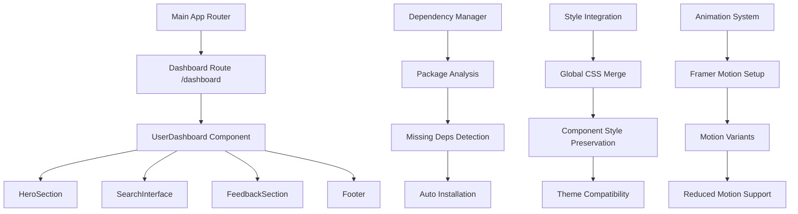

# User Dashboard Integration Design

## Overview

This design document outlines the architecture and implementation strategy for integrating the standalone user dashboard into the main PromptBrain application. The integration will maintain 100% design fidelity while establishing a clean, maintainable architecture that preserves all visual elements, animations, and functionality from the original Figma Make export.

## Architecture

### High-Level Integration Strategy

The integration follows a **modular encapsulation** approach where the user dashboard maintains its internal structure while being seamlessly integrated into the main application's routing and dependency system.



### Component Architecture

The user dashboard will be integrated as a self-contained module with the following structure:

```
src/
├── components/
│   └── pages/
│       └── UserDashboardPage.tsx (new integration wrapper)
├── user-dashboard/ (existing, preserved)
│   ├── src/
│   │   ├── components/
│   │   │   ├── HeroSection.tsx
│   │   │   ├── SearchInterface.tsx
│   │   │   ├── FeedbackSection.tsx
│   │   │   └── ui/ (Shadcn components)
│   │   └── styles/
│   │       └── globals.css
│   └── package.json
└── styles/
    └── user-dashboard-integration.css (new)
```

## Components and Interfaces

### 1. UserDashboardPage Component

**Purpose**: Integration wrapper that bridges the main app with the user dashboard

```typescript
interface UserDashboardPageProps {
  onNavigateToProfile?: () => void;
  onNavigateToLanding?: () => void;
  onLogout?: () => void;
}

export function UserDashboardPage(props: UserDashboardPageProps): JSX.Element
```

**Responsibilities**:
- Load user dashboard styles
- Handle navigation integration
- Manage authentication state
- Provide error boundaries

### 2. Dependency Integration System

**Purpose**: Automated dependency detection and installation

```typescript
interface DependencyManager {
  analyzePackageJson(path: string): Promise<DependencyAnalysis>;
  detectMissingDependencies(required: string[], installed: string[]): string[];
  installMissingPackages(packages: string[]): Promise<InstallationResult>;
  validateInstallation(packages: string[]): Promise<ValidationResult>;
}

interface DependencyAnalysis {
  required: PackageDependency[];
  missing: string[];
  conflicts: ConflictInfo[];
  recommendations: string[];
}
```

### 3. Style Integration Manager

**Purpose**: Merge and manage CSS without conflicts

```typescript
interface StyleIntegrationManager {
  loadDashboardStyles(): Promise<void>;
  mergeGlobalStyles(mainStyles: string, dashboardStyles: string): string;
  preserveComponentStyles(components: ComponentStyleMap): void;
  validateFontLoading(fonts: FontDefinition[]): Promise<boolean>;
}
```

### 4. Animation Integration System

**Purpose**: Ensure Framer Motion animations work correctly

```typescript
interface AnimationIntegrationSystem {
  validateFramerMotion(): Promise<boolean>;
  preserveMotionVariants(variants: MotionVariants): void;
  setupReducedMotionSupport(): void;
  validateAnimationTiming(config: AnimationConfig): boolean;
}
```

## Data Models

### Package Dependency Model

```typescript
interface PackageDependency {
  name: string;
  version: string;
  type: 'dependency' | 'devDependency' | 'peerDependency';
  required: boolean;
  conflictsWith?: string[];
}
```

### Style Configuration Model

```typescript
interface StyleConfiguration {
  globalStyles: string[];
  componentStyles: ComponentStyleMap;
  fontImports: FontImport[];
  cssVariables: CSSVariableMap;
  themeCompatibility: ThemeCompatibilityConfig;
}

interface FontImport {
  family: string;
  weights: number[];
  styles: ('normal' | 'italic')[];
  source: 'google' | 'local';
  url?: string;
}
```

### Animation Configuration Model

```typescript
interface AnimationConfiguration {
  motionVariants: MotionVariants;
  springConfig: SpringConfig;
  transitionTimings: TransitionTimings;
  reducedMotionFallbacks: ReducedMotionConfig;
}

interface SpringConfig {
  stiffness: number;
  damping: number;
  mass: number;
}
```

### Route Integration Model

```typescript
interface RouteIntegration {
  path: string;
  component: React.ComponentType;
  protected: boolean;
  theme?: string;
  preloadDependencies?: string[];
  styleSheets?: string[];
}
```

## Error Handling

### Dependency Resolution Errors

```typescript
class DependencyResolutionError extends Error {
  constructor(
    public missingPackages: string[],
    public conflicts: ConflictInfo[],
    public suggestions: string[]
  ) {
    super(`Failed to resolve dependencies: ${missingPackages.join(', ')}`);
  }
}
```

### Style Integration Errors

```typescript
class StyleIntegrationError extends Error {
  constructor(
    public conflictingStyles: string[],
    public missingFonts: string[],
    public cssErrors: CSSError[]
  ) {
    super('Style integration failed');
  }
}
```

### Animation System Errors

```typescript
class AnimationSystemError extends Error {
  constructor(
    public missingMotionComponents: string[],
    public invalidVariants: string[],
    public timingIssues: TimingIssue[]
  ) {
    super('Animation system integration failed');
  }
}
```

## Testing Strategy

### 1. Dependency Integration Tests

```typescript
describe('Dependency Integration', () => {
  test('should detect all required packages from user dashboard', async () => {
    const analysis = await dependencyManager.analyzePackageJson('src/user dashboard/package.json');
    expect(analysis.required).toContain('@radix-ui/react-*');
    expect(analysis.required).toContain('framer-motion');
    expect(analysis.required).toContain('lucide-react');
  });

  test('should install missing dependencies automatically', async () => {
    const result = await dependencyManager.installMissingPackages(['missing-package']);
    expect(result.success).toBe(true);
    expect(result.installed).toContain('missing-package');
  });
});
```

### 2. Style Integration Tests

```typescript
describe('Style Integration', () => {
  test('should preserve component-level styles', () => {
    const preservedStyles = styleManager.preserveComponentStyles(dashboardComponents);
    expect(preservedStyles.glassmorphism).toBeDefined();
    expect(preservedStyles.animations).toBeDefined();
  });

  test('should load Google Fonts correctly', async () => {
    const fontsLoaded = await styleManager.validateFontLoading([
      { family: 'Instrument Serif', weights: [400, 650] },
      { family: 'Outfit', weights: [100, 900] }
    ]);
    expect(fontsLoaded).toBe(true);
  });
});
```

### 3. Animation Integration Tests

```typescript
describe('Animation Integration', () => {
  test('should preserve Framer Motion variants', () => {
    const variants = animationSystem.preserveMotionVariants(originalVariants);
    expect(variants.spring.stiffness).toBe(400);
    expect(variants.spring.damping).toBe(30);
  });

  test('should respect reduced motion preferences', () => {
    animationSystem.setupReducedMotionSupport();
    const config = animationSystem.getAnimationConfig();
    expect(config.respectsReducedMotion).toBe(true);
  });
});
```

### 4. Visual Regression Tests

```typescript
describe('Visual Fidelity', () => {
  test('should match original Figma design', async () => {
    await page.goto('/dashboard');
    const screenshot = await page.screenshot();
    expect(screenshot).toMatchSnapshot('dashboard-visual-fidelity.png');
  });

  test('should preserve font rendering', async () => {
    await page.goto('/dashboard');
    const fontStyles = await page.evaluate(() => {
      const heading = document.querySelector('h1');
      return window.getComputedStyle(heading).fontFamily;
    });
    expect(fontStyles).toContain('Instrument Serif');
  });
});
```

### 5. Integration Tests

```typescript
describe('Full Integration', () => {
  test('should navigate to dashboard after authentication', async () => {
    await authenticateUser();
    await page.waitForURL('/dashboard');
    expect(page.url()).toContain('/dashboard');
  });

  test('should load all dashboard components without errors', async () => {
    const errors = [];
    page.on('console', msg => {
      if (msg.type() === 'error') errors.push(msg.text());
    });
    
    await page.goto('/dashboard');
    await page.waitForLoadState('networkidle');
    expect(errors).toHaveLength(0);
  });
});
```

## Implementation Phases

### Phase 1: Dependency Analysis and Installation
1. Analyze user dashboard package.json
2. Compare with main app dependencies
3. Install missing packages
4. Resolve version conflicts
5. Validate installation

### Phase 2: Style Integration
1. Create integration CSS file
2. Import dashboard global styles
3. Merge with main app styles
4. Preserve component-specific styles
5. Load Google Fonts

### Phase 3: Component Integration
1. Create UserDashboardPage wrapper
2. Import dashboard components
3. Update internal imports/paths
4. Handle navigation integration
5. Add error boundaries

### Phase 4: Animation System Setup
1. Validate Framer Motion installation
2. Preserve motion variants
3. Setup reduced motion support
4. Test animation timing
5. Validate spring physics

### Phase 5: Routing Integration
1. Add /dashboard route
2. Setup route protection
3. Configure redirects
4. Test navigation flows
5. Validate authentication

### Phase 6: Testing and Validation
1. Run dependency validation
2. Test visual fidelity
3. Validate animations
4. Check responsive design
5. Performance testing

This design ensures a systematic, maintainable integration that preserves the original dashboard's design fidelity while seamlessly integrating with the main application's architecture.